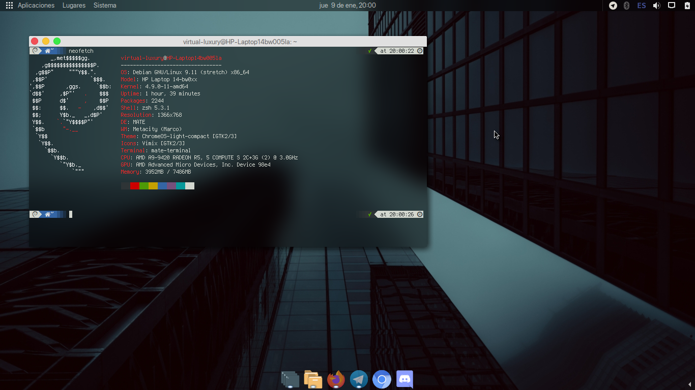

# hwdecorations

_Script python para ocultar la decoración de la ventana activa. Probado en MATE 1.20._

## Ejemplos

### Antes:

### Despues

## Cómo usar
Necesitas instalar python-gtk2, usa el comando `sudo apt install python-gtk2`
Descarga el script, guardalo en alguna carpeta donde no te importe tenerlo (en ~/.local por ejemplo).
En el menú de configuraciones de tu sistema, asigna una nueva combinación de teclas para ejecutar el script python.
Este es el comando que se debe ejecutar:
`python /ubicacion/del/script/hwdecorations.py`

